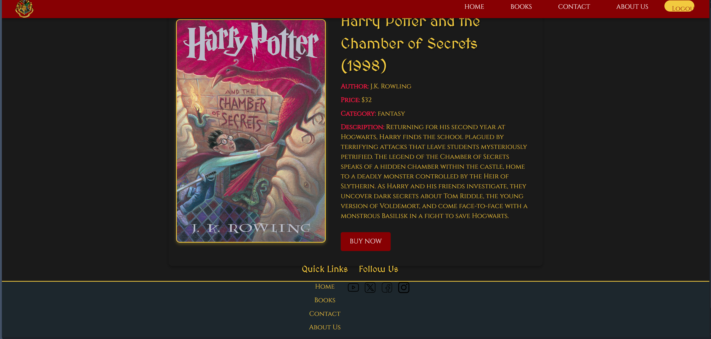

# Book Store Project

A full‑stack application for a Hogwarts‑themed bookstore. It provides:

- Backend: Node.js + Express + Sequelize (MySQL/PostgreSQL on RDS, SQLite for local dev)
- Frontend: React + Vite + Tailwind (with DaisyUI) and react-router
- Features: browse books, book details, admin add‑book, user signup/login, contact form, newsletter, and a simple checkout capture

## Project Structure

- `Backend/` Express API and Sequelize models/controllers
- `Frontend/` React client (Vite)
- Root `package.json` for concurrent dev of both apps

## Screenshots

- Homepage


- Book List Page


## Prerequisites

- Node.js 18+
- Local development uses SQLite (no extra install). For production set up an Amazon RDS instance (MySQL or PostgreSQL).

## Quick Start (Development)

1. Create backend environment file from example:

   - Copy `Backend/.env.example` to `Backend/.env` and adjust values if needed.

1. Install dependencies for root, backend, and frontend:

Run these from a Windows PowerShell terminal:

```powershell
cd "d:\Book Store Project - Copy - Copy\Backend"; npm install
cd ..\Frontend; npm install
cd ..
npm install
```

1. Start both servers (API at port 5000 by default, Vite dev server at port 5174):

```powershell
npm start
```

The root script runs backend and frontend concurrently.

1. (Optional) Seed sample books into the development database:

```powershell
cd Backend; npm run seed; cd ..
```

## Deployment Guides

- [Ubuntu EC2 with Nginx + PM2](docs/DEPLOYMENT_EC2.md)
- [AWS Elastic Beanstalk + S3 (Full Stack)](docs/DEPLOYMENT_EB.md)
- [S3 Bucket Setup & Block Public Access](docs/S3_SETUP.md)

## Environment Variables

Backend (`Backend/.env`):

- `PORT` API port. Default: `5000`
- `ADMIN_EMAIL` Email that should be treated as the admin user for demo purposes.
- `DB_DIALECT` Database driver. Use `sqlite` locally, `mysql` or `postgres` for Amazon RDS.
- `DB_STORAGE` SQLite file path for local development (`./dev.sqlite`).
- `DB_HOST`, `DB_PORT`, `DB_NAME`, `DB_USER`, `DB_PASSWORD` RDS connection details (required when `DB_DIALECT` is not `sqlite`).
- `DB_SSL` Set to `true` when the RDS instance requires SSL.
- `DB_SYNC_ALTER` Set to `true` on first deploy to let Sequelize auto-create tables (turn back to `false` afterwards).
- `AWS_REGION`, `AWS_ACCESS_KEY_ID`, `AWS_SECRET_ACCESS_KEY`, `AWS_SESSION_TOKEN`, `S3_BUCKET`, `S3_PREFIX`, `S3_ACL`, `S3_ENDPOINT`, `S3_FORCE_PATH_STYLE` Configure uploads to Amazon S3 or an S3-compatible service (LocalStack/MinIO). Leave them unset to store images on local disk (`UPLOAD_DIR` controls the folder, default `Backend/public`).


Frontend (optional `Frontend/.env`):

- Set `VITE_API_BASE_URL` to match your backend, e.g., `http://localhost:5000`.

## API Overview

Base URL: `http://localhost:5000` (backend)
Frontend: `http://localhost:5174`

- `GET /book` — list all books
- `GET /book/:id` — get book by id
- `POST /book` — add book (admin UI uses this)
- `POST /user/signup` — create a user (password hashed)
- `POST /user/login` — login, returns minimal user info and an `isAdmin` flag if the email matches the configured admin email
- `POST /contact` — submit contact form
- `POST /newsletter` — subscribe email to newsletter
- `POST /checkout` — create a checkout record (captures address and mock payment fields; this is not real payment processing)

## Important Notes & Known Limitations

- Security: There is no JWT/session implemented yet. Login returns a user object and the client stores it in localStorage. Do not use in production as-is.
- Admin: Uses an environment variable `ADMIN_EMAIL` to flag an admin account on login. Replace with role-based auth and secure tokens for production.
- Checkout: The server does not store `cardNumber`, `expiryDate`, or `cvv`. For real payments, integrate a PCI-compliant provider (e.g., Stripe) and never handle raw card data on your server.
- CORS: Enabled broadly for development.
- Schema field name: Book schema uses `category`. Ensure clients send `category` (not `Category`).

## Database

- Local development defaults to SQLite (`dev.sqlite` in the backend folder). No additional setup is required.
- Production uses Amazon RDS (MySQL or PostgreSQL). Provide the RDS endpoint and credentials via the `DB_*` environment variables.
- Sequelize manages the schema automatically. On the first deploy set `DB_SYNC_ALTER=true` so the tables are created; switch it back to `false` afterwards.
- Key tables: `books`, `users`, `contacts`, `newsletters`, `checkouts`.
- Use any SQL client (e.g., `psql`, MySQL Workbench) to inspect data once the RDS instance is provisioned.

## Scripts

From the repo root:

- `npm start` — runs backend and frontend concurrently
- Backend only: `cd Backend && npm start`
- Frontend only: `cd Frontend && npm run dev`

## Tech Stack

- Backend: Express, Sequelize, bcryptjs, dotenv, cors, AWS SDK v3
- Frontend: React 18, Vite 6, react-router-dom 7, axios, tailwindcss, daisyui, react-slick

## Development Tips

- Seed data: Run `npm run seed` or insert records via SQL (`books` table) to see the UI populate. Minimal shape:
  `{ name, price, category, image, title, description }`
- Static images: When S3 is configured, book images are uploaded there; otherwise they are saved under `Backend/public`. The frontend accepts absolute S3 URLs or relative paths.
- Testing S3 locally: export the S3 variables in `Backend/.env` and point them at either a real AWS bucket or an emulator like LocalStack/MinIO using `S3_ENDPOINT` and `S3_FORCE_PATH_STYLE=true`. Without those variables, uploads default to `Backend/public` (configurable via `UPLOAD_DIR`).

## Troubleshooting

- Database connection errors: Verify `DB_*` variables and that the RDS instance or SQLite file is reachable. Ensure security groups allow inbound traffic from Elastic Beanstalk.
- CORS/Network: The frontend calls `http://localhost:5000`. If you change backend port, update calls or introduce a `VITE_API_BASE_URL`.
- Route casing: Backend routes are lowercase (e.g., `/checkout`).

## Security Review (What we checked and fixed)

- Removed hardcoded admin email: the server now reads `ADMIN_EMAIL` from env. Set it in `Backend/.env`.
- Prevent committing secrets: added root `.gitignore` to ignore `*.env`. Use the provided `Backend/.env.example` template.
- Checkout privacy: server no longer stores `cardNumber`, `expiryDate`, or `cvv`. For real payments, integrate a provider like Stripe.
- Sanitized `.env`: if a `Backend/.env` exists locally, ensure it only contains safe values (e.g., SQLite settings or non-production credentials). Do not commit real secrets.

If you previously committed secrets, rotate them and remove from history using tools like `git filter-repo`.

## Security Checklist for Open Source

- No secrets committed: `.env` is git-ignored. Use `Backend/.env.example` as a template.
- Do not include real API keys, passwords, JWT secrets, or connection strings to production databases.
- Consider adding eslint/prettier and basic tests for PRs.

## License

MIT License
